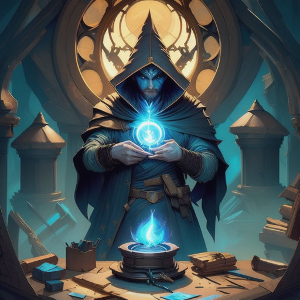

# Arcane Assembly - A Spell Crafting game
[![Discord][discord-shield]][discord-url]
[![Stargazers][stars-shield]][stars-url]
[![Issues][issues-shield]][issues-url]

Arcane Assembly is both a physical card game and an on-chain game set in the Realms Autonomous World.

We are proud to be part of the [Frontinus House Genesis Builders Program](https://bibliothecadao.notion.site/Frontinus-House-59abea155d2743239cac07f59350a06f) supported by [Bibiotheca DAO](https://bibliothecadao.xyz/)

<p align="middle" float="left">
   
</p>

## About

Arcane Assembly is a single player time and resource management survival game. You play as a mage trying to craft the most powerful spell the world has ever seen. Spells are crafted by sourcing and adding rare components from across the world. 

Unfortunately searching for components takes time and while not attended to a spell will become increasingly chaotic, eventually spiralling out of control and destroying it's creator.

Players must carefully manage their time while foraging, summoning helpers and researching new abilities in order to keep their spell under control while increasing its power.

Play with cards at home or play on-chain in the Realms Autonomous World to showcase your strongest spells for all to see.

## Roadmap

- [x] Outline all cards/components and their effects
- [ ] Physical Card Game
    - [x] Script to generate card images from cards sheet
    - [x] Play-test card layouts
    - [x] Forage mechanic
    - [x] Familiars mechanic
    - [x] Study mechanic
    - [ ] Final art and layout
- [ ] Dojo/Starknet Contracts
    - [x] Code generation of contracts from cards sheet
    - [x] Spell interaction
    - [x] Forage mechanic
    - [ ] Familiars mechanic
    - [ ] Study mechanic
    - [ ] Unmanipulatable randomness
    - [ ] Real-time Gameplay
- [ ] Web Client
    - [x] Basic client for rapid prototyping
    - [ ] Mobile first game interface
        - [ ] Game loop design
        - [x] Music
        - [ ] Background/character art
        - [ ] UI Art
        - [ ] Phaser/Renjs Integration with Dojo/Starknet
- [ ] Refine parameters for balance and fun
## Development
### Prerequisites

This repo uses [just](https://github.com/casey/just) for running commands. It is like a modern version of Make.

### Running locally

#### Requirements

- Installed [bun](https://bun.sh/)
- Installed [Dojo tooling](https://www.dojoengine.org/en/)

#### Steps

First build the contracts

```shell
just build_contracts
```

It is best to run 3 separate shells to run the game locally. Run each of the below commands in a new terminal

- Katana local devnet:  
```shell
just start_devnet
```

- Migrate contracts and start indexer:  
```shell
just start_indexer
```

- Client webserver  
```shell
just start_client
```

If everything ran correctly this should open your browser with the game ready to play!

### Updating generated code

The code in the `contracts/properties` directory is generated from the `cards.csv`. If you make any changes to cards stats you can regenerate these using

```shell
just codegen
```

## Generating cards images

If you want to play test the physical version you can produce all the cards from the `cards.csv` table.

Requires:
- python3
- just 

Run the command

```shell
just cardgen
```

This will dump the images in `cards-output`.

Follow this guide to print them at the desired size https://www.wikihow.com/Print-Multiple-Images-on-One-Page-on-PC-or-Mac

<!-- CONTACT -->
## Contact

Willem Olding - [@willemolding1](https://twitter.com/willemolding1) - willemolding@gmail.com

Project Link: [https://github.com/ArcaneAssemblers/spellcrafter](https://github.com/ArcaneAssemblers/spellcrafter)

<!-- MARKDOWN LINKS & IMAGES -->
<!-- https://www.markdownguide.org/basic-syntax/#reference-style-links -->
[contributors-shield]: https://img.shields.io/github/contributors/ArcaneAssemblers/spellcrafter.svg?style=for-the-badge
[contributors-url]: https://github.com/ArcaneAssemblers/spellcrafter/graphs/contributors
[forks-shield]: https://img.shields.io/github/forks/ArcaneAssemblers/spellcrafter.svg?style=for-the-badge
[forks-url]: https://github.com/ArcaneAssemblers/spellcrafter/network/members
[stars-shield]: https://img.shields.io/github/stars/ArcaneAssemblers/spellcrafter.svg?style=for-the-badge
[stars-url]: https://github.com/ArcaneAssemblers/spellcrafter/stargazers
[issues-shield]: https://img.shields.io/github/issues/ArcaneAssemblers/spellcrafter.svg?style=for-the-badge
[issues-url]: https://github.com/ArcaneAssemblers/spellcrafter/issues
[license-shield]: https://img.shields.io/github/license/ArcaneAssemblers/spellcrafter.svg?style=for-the-badge
[license-url]: https://github.com/ArcaneAssemblers/spellcrafter/blob/master/LICENSE.txt

[discord-shield]: https://img.shields.io/discord/884211910222970891?style=for-the-badge
[discord-url]: https://discord.com/channels/884211910222970891/1148509088326619218
